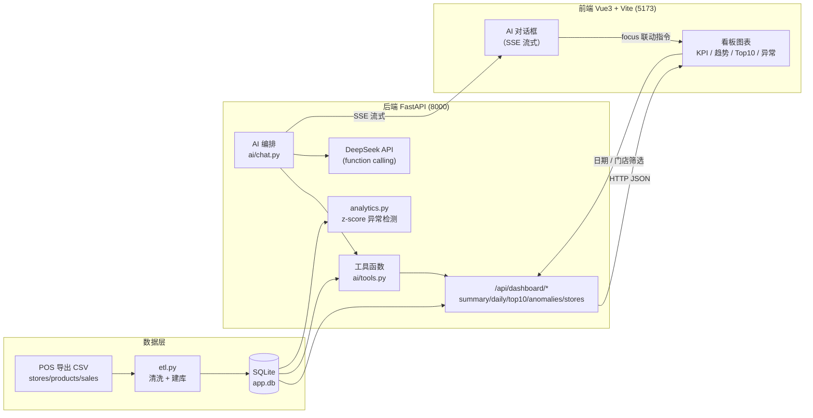

# Moneki 连锁餐饮经营看板 + AI 数据问答

一个前后端分离的连锁餐饮经营分析看板，内置基于 **真实数据库取数** 的 AI 数据问答助手。

- **数据看板**：KPI 指标卡、营业额趋势、Top10 商品、异常销售预警，支持日期区间 + 门店筛选
- **AI 问答**：对话式提问，答案中的所有数字都来自 SQL 查询结果，LLM 不接触原始 CSV、不凭记忆编造
- **图表联动**：AI 回答时，前端看板自动跳转到该问题涉及的日期区间 / 门店
- **可测试**：AI 回答配有自动化测试（确定性 + 数学验证 + 真实集成），保证"数字可信"

仓库地址：https://github.com/Carl7806/moneki-fullstack-assignment

---

## 一、快速开始（3 步）

> 依赖：Python 3.10+、Node.js 18+

### 第 1 步：安装后端依赖并跑数据清洗（ETL）

```bash
cd backend
pip install -r requirements.txt
python etl.py
```

`etl.py` 会清洗 `data/` 下的三张 POS 导出 CSV，并生成 SQLite 数据库 `backend/app.db`（清洗规则见下文「数据清洗」）。

### 第 2 步：配置 AI Key 并启动后端

```bash
# 在 backend 目录下，复制环境变量模板并填入 DeepSeek Key
copy .env.example .env        # Windows；macOS/Linux 用 cp .env.example .env
# 编辑 .env，填入 DEEPSEEK_API_KEY=sk-xxx

python -m uvicorn main:app --host 127.0.0.1 --port 8000
```

后端默认监听 `http://127.0.0.1:8000`，交互式 API 文档见 `http://127.0.0.1:8000/docs`。

> 注：未配置 `DEEPSEEK_API_KEY` 时看板可正常使用，但 AI 问答会报错提示配置 Key。

### 第 3 步：启动前端

```bash
cd frontend
npm install
npm run dev
```

前端默认监听 `http://localhost:5173`（已配置代理把 `/api` 转发到 8000 后端）。浏览器打开即看板，右下角是 AI 对话框。

> Windows PowerShell 若遇到执行策略或 npm 缓存权限问题：使用 `npm.cmd` 代替 `npm`，例如 `npm.cmd install`、`npm.cmd run dev`。

---

## 二、架构图



一次 AI 问答的完整链路：用户提问 → `chat.py` 组装 system prompt → DeepSeek 依据工具声明**选定工具并给出参数** → `tools.py` 用参数执行**真实 SQL** → 查询结果回填给模型 → 模型基于结果生成自然语言 → 后端从工具参数推导 `focus`（日期/门店）→ 前端按 `focus` 联动看板图表。

---

## 三、技术选型理由

| 模块 | 选择 | 理由 |
|---|---|---|
| 后端框架 | Python + FastAPI | 异步高性能、类型友好、自动生成 OpenAPI 文档，适合快速搭建 Dashboard 接口 |
| 数据库 | SQLite | 数据仅约 1.2 万行、单机部署，零运维；专注业务逻辑，不引入 MySQL 的部署负担 |
| 数据清洗 | 纯 stdlib（csv + sqlite3） | 清洗逻辑可复现、少第三方依赖；用脚本而非手工，保证对账可验 |
| 前端 | Vue 3 + Vite | 组合式 API 便于抽组件，开发热更新快；`Composition API + <script setup>` 简洁 |
| 图表 | ECharts | 生态成熟、图表类型全、交互（tooltip/缩放）开箱即用 |
| AI 编排 | DeepSeek + function calling | 让模型「选工具给参数」而非「直接报数」，从机制上杜绝编造；国产模型成本低 |
| 流式输出 | SSE（Server-Sent Events） | 相比 WebSocket 更轻、单向推送即满足"逐字显示 + 状态提示"，实现简单 |
| 测试 | pytest + mock | 用假 LLM 客户端做确定性测试，配合真实集成测试，双重保障数字可信 |

---

## 四、数据清洗

原始 `sales.csv` 共 **12,131** 条明细，清洗后入库 **12,015** 条，对账：`12131 - 30（脏商品外键）- 7（脏门店外键）- 79（重复行）= 12015`。

| 清洗规则 | 处理内容 | 数量 |
|---|---|---|
| 日期归一化 | 统一 `YYYY-MM-DD`，兼容 `YYYY/MM/DD`、`DD-MM-YYYY` | — |
| 外键清洗 | `store_id`/`product_id` 去空格 + 大写；指向不存在门店/商品的脏外键剔除 | 剔除 37（30 商品 + 7 门店） |
| 金额清洗 | 去掉 `¥`/`￥` 符号；负数保留（退款）；缺失时用 `qty × unit_price` 补齐 | 补齐 119 |
| 数量修复 | `qty ≤ 0` 但金额为正且为单价整数倍时，用 `amount / unit_price` 反推 | 修复 25 |
| 去重 | 规范化后完全相同的明细行去重（含日期/大小写差异导致的伪重复） | 剔除 79 |

### 核心指标定义（口径）

- **营业额** = `SUM(amount)`，退款（负金额）自动抵扣
- **订单数** = 正金额订单的**去重计数**（排除退款，避免稀释客单价）
- **客单价** = 营业额 / 订单数
- **退款额** = `SUM(负金额)`

---

## 五、目录结构

```
moneki-fullstack-assignment/
├── data/                        # POS 导出的原始 CSV（三张）
│   ├── stores.csv
│   ├── products.csv
│   └── sales.csv
├── backend/
│   ├── etl.py                   # 数据清洗 + 建库
│   ├── db.py                    # 数据库访问层（连接复用、查询助手）
│   ├── analytics.py             # z-score 异常检测（共享模块）
│   ├── main.py                  # FastAPI 路由 /api/dashboard/*
│   ├── ai/
│   │   ├── chat.py              # AI 编排：工具选择→SQL→回填→生成 + focus 推导
│   │   └── tools.py             # 工具定义与分发（5 个工具走真实 SQL）
│   ├── tests/
│   │   └── test_ai_answers.py   # AI 回答自动化测试
│   ├── requirements.txt
│   └── .env.example             # DEEPSEEK_API_KEY 模板
└── frontend/
    ├── src/
    │   ├── App.vue              # 看板 + 筛选 + 联动
    │   ├── api.js               # 前端 API 封装
    │   ├── components/
    │   │   ├── KpiCard.vue
    │   │   ├── RevenueChart.vue
    │   │   ├── TopProducts.vue
    │   │   ├── AnomalyPanel.vue # 异常销售预警
    │   │   └── ChatPanel.vue    # AI 对话框（SSE 流式 + 联动触发）
    │   └── style.css
    └── package.json
```

---

## 六、API 一览

| 方法 | 路径 | 说明 | 参数 |
|---|---|---|---|
| GET | `/api/dashboard/summary` | 总营业额 / 订单数 / 客单价 / 退款额 | `start` `end` `store_id` |
| GET | `/api/dashboard/daily` | 每日趋势 | `start` `end` `store_id` |
| GET | `/api/dashboard/top10` | Top10 商品 | `start` `end` `store_id` |
| GET | `/api/dashboard/anomalies` | 异常销售预警（z-score） | `start` `end` `store_id` |
| GET | `/api/dashboard/stores` | 门店列表 | — |
| POST | `/api/chat` | AI 问答（非流式） | `{message, history}` |
| POST | `/api/chat/stream` | AI 问答（SSE 流式） | `{message, history}` |

---

## 七、AI 问答机制

- **数字只来自工具内的数据库查询**：模型不接触 CSV 原文，只能通过 5 个工具（总览 / 排行 / 单品 / 趋势 / 异常）查询，回答中的每个数字都对应一条真实 SQL 结果。
- **关键词兜底**：对「异常 / 预警」类意图，后端用关键词预判并确定性触发工具，规避 LLM 工具选择的漂移。
- **异常条数以 `total` 为准**：prompt 明确要求引用工具返回的 `total`，而非自行去数 `items`。
- **联动指令 focus**：从工具调用参数自动推导日期区间与门店，前端据此刷新看板。

相关设计细节与「AI 工具怎么用、AI 出错如何发现与修复」见 [AI_USAGE.md](./AI_USAGE.md)。

---

## 八、测试

```bash
cd backend
python -m pytest tests/ -v
```

覆盖两类用例：

1. **确定性测试**（不联网，用假 LLM 客户端）：工具 = 真实 SQL、异常检测数学验证、focus 推导、门店过滤口径。
2. **集成测试**（需 `DEEPSEEK_API_KEY`）：真实调用模型，抽取回答中的数字与数据库逐项比对，验证「回答≠编造」。

---

## 扩展资料

- [AI_USAGE.md](./AI_USAGE.md) — AI 工具使用说明（拆任务 prompt、出错与修复、人工 vs AI 分工）
- [DEMO.md](./DEMO.md) — 三个真实 AI 问答示例及「数字为什么可信」的核对过程